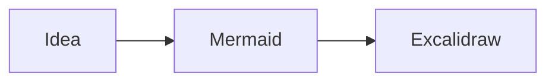
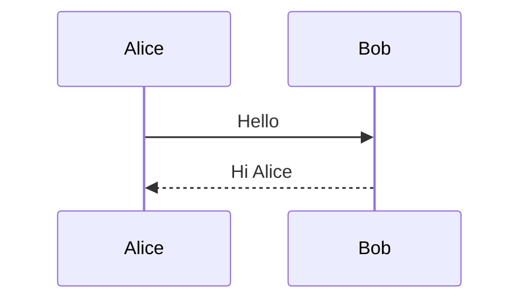
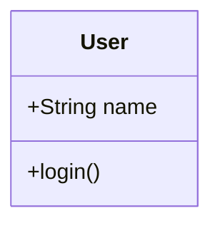
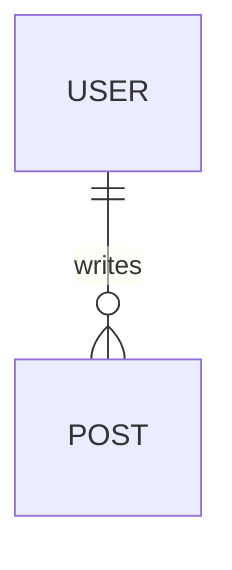
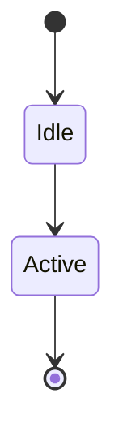
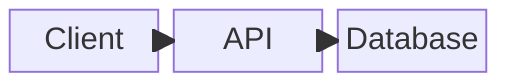

# Mermaid Excalidraw Renderer

Render Mermaid diagrams in an Excalidraw-style view directly inside your Obsidian notes.

Write Mermaid text in a normal `mermaid` code block and use **Reading view or Live Preview**. Enabling the plugin renders these blocks in Excalidraw by default, without changing your notes. The plugin works independently of the Excalidraw community plugin. Dedicated `mermaid-excalidraw` blocks also continue to work.

**Upgrading to 0.1.1 changes the initial appearance of existing standard Mermaid blocks.** New installations and older settings without the new option default to ON. To keep Obsidian’s standard display, turn off **Render standard mermaid blocks as Excalidraw** in the plugin settings. A saved OFF value remains OFF after restarting or disabling/re-enabling the plugin.

## Features

- Passive inline Flowchart and Sequence diagrams, with automatic fitting and an enlarged read-only preview for pan/zoom.
- Class, ER and State diagrams displayed using Mermaid SVG fallback in the current release.
- SVG fallback for other supported Mermaid types, including Block (`block-beta`), Gantt, Pie and Timeline.
- Light/Dark theme following, with black or white text and lines chosen for background contrast.
- Font size, roughness, canvas height and padding controls.
- Multiple independent diagrams per note and safe inline errors for invalid input.

SVG fallback preserves Mermaid geometry: it does not turn every diagram type into hand-drawn Excalidraw elements. Roughness and font-size changes may not affect fallback images in the same way as native diagrams.

Block Diagrams (`block-beta`) are verified as SVG fallback in production-bundle browser tests and Obsidian 1.14.4 desktop Reading view. Simple blocks, arrows, column spans and nested composites remain readable in Light/Dark, including theme changes; invalid input stays isolated and diagrams clean up when switching notes. Each diagram is a single SVG image, so its blocks, arrows and labels are not independent or separately editable Excalidraw elements. Roughness does not change SVG geometry; native Block conversion requires upstream support and a compatible published converter release.

## Installation

**Requirements:** Obsidian **1.14.4 or newer**, desktop app. Mobile is untested and is not supported in this first release.

### Community directory

[Mermaid Excalidraw Renderer is listed in the Community Directory](https://community.obsidian.md/plugins/mermaid-excalidraw-renderer). Use [Add to Obsidian](obsidian://show-plugin?id=mermaid-excalidraw-renderer), or install from within Obsidian:

1. Open **Settings → Community plugins → Browse**.
2. Search for **Mermaid Excalidraw Renderer** and open its entry.
3. Select **Install**, then **Enable**.

### Manual installation

Download attachments from a published release; draft releases are not publicly downloadable.

1. Download `main.js`, `manifest.json` and `styles.css` from a [GitHub release](https://github.com/taichocop/mermaid-excalidraw-renderer/releases). Use the attached files, not the source-code ZIP.
2. Create `<vault>/<config-folder>/plugins/mermaid-excalidraw-renderer/`. The configuration folder is normally `.obsidian`, but may be customized.
3. Put all three files in that folder, restart Obsidian, and enable **Mermaid Excalidraw Renderer** under **Settings → Community plugins**.

Optional `SHA256SUMS.txt`, `LICENSE` and `THIRD_PARTY_NOTICES.txt` attachments allow you to verify downloads and inspect licenses. Licenses are also embedded in `main.js`, so the normal three-file installation includes the required notices.

## Usage

Copy this complete block into a note, then use Reading view or Live Preview (the standard-block setting defaults to ON):

````markdown

````

Use `mermaid-excalidraw` instead of `mermaid` for a block that should always use this plugin, even when the standard-block setting is OFF.

In Live Preview, move the cursor into the block (including either fence), or select across it, to show its source. Move the selection outside the block to render the latest source. Standard-block replacements are suspended during IME composition. The plugin changes only the display; it does not rewrite Markdown, languages, selections or Undo history. Source mode always keeps the editable Markdown.

Dedicated `mermaid-excalidraw` blocks keep Obsidian’s existing code-block widget and editing behavior in Live Preview. The new editor extension only replaces standard `mermaid` blocks, so it does not add a second dedicated canvas. The standard-block toggle never disables dedicated blocks.

| Mode | Standard `mermaid` ON | Standard `mermaid` OFF | `mermaid-excalidraw` |
| --- | --- | --- | --- |
| Reading view | Excalidraw | Host renderer | Excalidraw |
| Live Preview | Excalidraw outside the selection | Host renderer | Existing host code-block widget |
| Source mode | Editable Markdown | Editable Markdown | Editable Markdown |

Inline diagrams are passive: scroll input over a diagram goes to the note, and dragging does not pan the diagram. Click the diagram to open an enlarged preview, or focus its **Open enlarged Mermaid diagram** button and press **Enter** or **Space**. The standard-block setting must be ON for standard `mermaid` previews; dedicated blocks remain enabled with either setting.

In the enlarged preview, use **Zoom in**, **Zoom out**, **Fit to content** and **Reset zoom** (100%, centered on the content). Drag the canvas with a mouse or pen to pan. Wheel/trackpad navigation is disabled inside the preview so it cannot scroll the note behind it. Press **Esc**, **Close preview**, or the host close button to return to the diagram without changing the note or its scroll position. Focus returns to the diagram button when it still exists. Tab and Shift+Tab keep focus inside the preview. Opening another diagram replaces the existing preview in the activating desktop window. Replacing or editing the source, turning standard rendering OFF, or disabling the plugin closes the affected preview; font-size changes also close it while reconverting.

Edit the source text to change the diagram. Both displays stay read-only: the preview blocks drawing edits, clipboard copy/paste, import/save, export, links and editor dialogs. Host shortcuts are suspended while the enlarged viewer has focus. The inline button leaves normal note shortcuts and clipboard behavior available. Touch canvas interaction is unsupported. Copy the Mermaid source from your note editor when needed.

### Sequence diagram

````markdown

````

### Class, ER and State diagrams

These examples currently display as SVG images inside the canvas:

````markdown





````

### Block Diagram

The fixture below displays as SVG fallback. Edit the Mermaid source to change its blocks and connections; they are not independently editable canvas elements.

````markdown

````

## Settings

Open **Settings → Mermaid Excalidraw Renderer**. Changes update open diagrams and persist in your vault's plugin settings.

| Control | Default | Range / behavior |
| --- | --- | --- |
| Render standard mermaid blocks as Excalidraw | ON | Reading view and Live Preview; OFF restores Obsidian’s standard rendering. Dedicated blocks always use Excalidraw. |
| Font size | 20 px | 12–48 px; native diagram text |
| Roughness | Architect (1) | Clean (0), Architect (1), Artist (2) |
| Canvas height | 600 px | 240–1200 px |
| Canvas padding | 32 px | 16–128 px; extra space for canvas controls |
| Theme | Follow Obsidian | Uses the note background and contrasting black/white foreground |

The standard-block toggle immediately updates all open Live Preview editors and requests a full redraw of open Reading views, including split panes; rendering may briefly show a loading indicator. Cached previews in editing panes are also invalidated, so returning to Reading view uses the current setting. Disabling the plugin also clears its canvases and refreshes Markdown preview caches so standard Mermaid can render again, including when returning from editing mode. The note text and other plugins’ registrations are preserved. Explicit OFF values are saved; missing or invalid values default to ON.

Canvas width follows the note. Small diagrams are not enlarged beyond 100%. In very narrow panes, padding is reduced to leave room for content. Legacy `maxHeight` settings migrate to canvas height.

## Privacy and security

No payment, account, ads or telemetry are required or included. Plugin-owned runtime code does not scan your vault, modify notes, request Node filesystem access, or install/update itself or its dependencies. Plugin settings are saved through Obsidian's public API. Bundled upstream code retains conditional browser file-launch and dialog/storage helpers; the exposed viewer controls are restricted, but this is not an API sandbox. See [SCORECARD_TRIAGE.md](SCORECARD_TRIAGE.md) for the traced conditions and tested interactions.

Rendering uses bundled JavaScript and fonts and works offline. Before calling the converter, both standard and dedicated blocks reject resource-capable source with an inline error: image/node metadata (`@{…}`), Sequence `properties`/`details` (including actor icons), resource HTML attributes/tags, Markdown images, CSS image/import syntax and URLs. Backslash escapes, HTML/Mermaid entities and CSS comments are also refused because they can conceal those constructs. This conservative policy can reject harmless labels, comments, escaped text and non-image metadata, including any occurrence of the words `properties` or `details`; simplify the source to use this renderer.

The plugin does not use Obsidian’s built-in Mermaid trust prompt. The source guard applies even when a vault is trusted and cannot be disabled for dedicated blocks. Turning the standard-block setting OFF returns standard blocks to Obsidian’s renderer and its own trust behavior; this plugin’s guard no longer processes those blocks. Diagram links are prevented from opening through this plugin’s canvas. See [SECURITY.md](SECURITY.md) for the threat model and private reporting instructions.

Mermaid runs in strict mode with protected security configuration. Inputs are limited to 50,000 characters and 500 edges. Errors are displayed as text. Strict mode and size limits reduce risk; they do not make arbitrary imported diagrams a security sandbox.

## Known limitations and troubleshooting

- Live Preview uses a public CM6 StateField with block replacements, separately from Reading view. Closed backtick/tilde `mermaid` fences are recognized through the editor’s syntax tree; unknown/incomplete syntax trees, unclosed fences, extra language parameters and quote/callout prefixes stay on the host path. Nested list/container fences are not verified. Parsing may catch up after scrolling in a large note.
- PR #28's production-bundle browser suite passed **60/60 tests** after a sequential build. Native checks in **Obsidian 1.14.4** verified passive inline note scrolling with trusted wheel input, main-window Modal controls and pan, Esc with focus restoration, Flowchart/Sequence native diagrams and Class/ER/State/Block SVG fallback, Live Preview editing/Undo/Redo and Japanese IME, Source Mode, theme changes, standard OFF with dedicated blocks independent, unload/note-switch cleanup, and native popout Modal owner-document placement and disposal. The maintainer completed native popout Escape focus restoration as human acceptance. As recorded in PR #28, that native acceptance preceded the final Reset and Modal focus repairs; those repairs have production-browser regression coverage, and native acceptance was not repeated for PR #28. Subsequent Issue #32 native acceptance in Obsidian 1.14.4 verified menu/background chrome absence, enlarged-preview controls, centered Reset, five-control forward/reverse Tab cycles and Escape/Close focus restoration in the main window. These checks do not establish compatibility with every OS input method or third-party plugin; the 1.14.4+ desktop requirement remains.
- **The maintainer completed physical two-finger hardware trackpad acceptance.** This human acceptance is separate from the earlier horizontal-input checks using trusted events sent through the official Chrome DevTools Protocol (CDP). Trusted CDP horizontal events and browser mocks do not establish physical trackpad gesture behavior.
- Standard-block rendering uses an ordered Markdown postprocessor and leaves Obsidian’s renderer and other plugins’ registrations intact. Third-party Mermaid plugin compatibility has not been verified in Obsidian; use the OFF setting and dedicated blocks when combining renderers.
- Mobile has not been tested. The browser-compatible code does not establish mobile compatibility.
- Class/ER/State fall back to SVG with Mermaid 11.17.2 and converter 2.2.2. This secure dependency combination is preferred over downgrading Mermaid for conversion fidelity.
- SVG fallback preserves upstream layout; Gantt date-axis labels can overlap in narrow views.
- Appearance is normalized to monochrome; Mermaid's original colors are not preserved.
- Very large diagrams may need panning because Excalidraw's minimum zoom is 10%. Expensive input can still block rendering; there is no hard timeout or worker isolation.
- Resource-capable source is not supported, including benign extended node metadata, `properties`/`details` keywords, URL text, backslash escapes and entity syntax. Refusal happens before conversion and does not affect other diagrams.
- **Obsidian Sync Standard has a [5 MB maximum file size](https://obsidian.md/help/sync/plans).** The bundled `main.js` is about 26 MB because it includes offline fonts and diagram renderers, so it exceeds that limit. Install the plugin separately on each desktop through the Community Directory or the three runtime release files; do not rely on Standard to transfer this bundle. This limitation does not prevent local installation.
- Bundled upstream font/image helpers retain inline WASM, generated function wrappers and conditional browser capabilities. These scanner flags do not by themselves prove vault/file/network access. See the evidence and unresolved checks in [SCORECARD_TRIAGE.md](SCORECARD_TRIAGE.md).

If nothing appears, check the block language, plugin enablement, the standard-block setting and Reading view/Live Preview. For an inline error, simplify the Mermaid source and check its syntax locally. For an issue report, include plugin/Obsidian versions, OS, theme and a minimal example with private text removed. [Report a bug](https://github.com/taichocop/mermaid-excalidraw-renderer/issues).

Disable the plugin to stop rendering; your Mermaid source remains in the note. To roll back manually, replace all three runtime files with files from the same earlier release and restart Obsidian.

## Development

Use Node.js 22.13+ within the 22 series, or 24+, and npm 10+. Node.js is only required for development.

```sh
npm ci
npm run lint
npm run typecheck
npm test
npm run test:release
npm run build
npm run test:browser
```

The output is `dist/mermaid-excalidraw-renderer/`. Local browser tests use Google Chrome; for Chromium run `npx playwright install chromium` followed by `PLAYWRIGHT_CHANNEL=chromium npm run test:browser`. Set `MERMAID_BROWSER_PORT=4176` for an isolated browser-test port (default: 4173); the value must be an integer from 1 to 65535. The harness server and Playwright use the same value. Browser tests exercise the actual production bundle with a mocked Obsidian host, including real CM6 EditorViews, source edits, Undo/Redo, composition events, settings/mode changes and disposal. Composition events do not prove OS IME behavior. Native-host and mobile testing are separate checks.

See [CONTRIBUTING.md](CONTRIBUTING.md), [release readiness](RELEASE_READINESS.md), [CHANGELOG.md](CHANGELOG.md) and [SECURITY.md](SECURITY.md).

## License and acknowledgments

[MIT](LICENSE), copyright 2026 taichi. This is an independent community project.

Rendering uses [Excalidraw](https://github.com/excalidraw/excalidraw), [mermaid-to-excalidraw](https://github.com/excalidraw/mermaid-to-excalidraw), [Mermaid](https://github.com/mermaid-js/mermaid) and [React](https://github.com/facebook/react). Bundled dependency and font licenses are generated in `THIRD_PARTY_NOTICES.txt` and embedded in `main.js`; additional font license sources are in [licenses/](licenses/).
