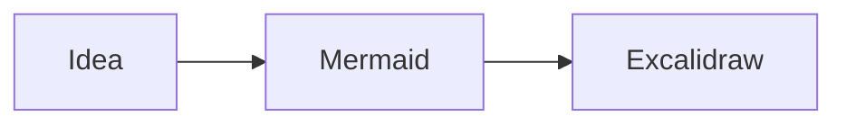
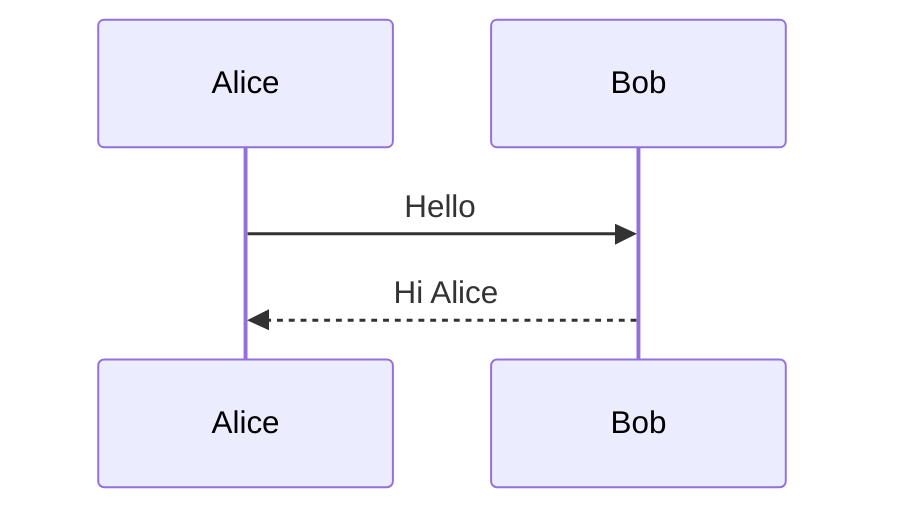
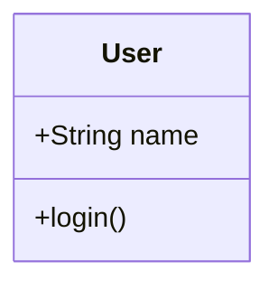
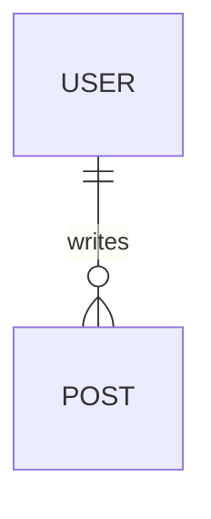
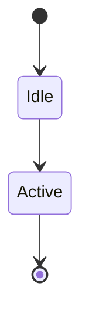

# Mermaid Excalidraw Renderer

Render Mermaid diagrams in an Excalidraw-style view directly inside your Obsidian notes.

Write Mermaid text in a `mermaid-excalidraw` code block and open **Reading view**. The plugin works independently of the Excalidraw community plugin and leaves standard `mermaid` blocks unchanged.

## Features

- Hand-drawn Flowchart and Sequence diagrams, with pan, zoom and automatic fitting.
- Class, ER and State diagrams displayed using Mermaid SVG fallback in the current release.
- SVG fallback for other supported Mermaid types, including Gantt, Pie and Timeline.
- Light/Dark theme following, with black or white text and lines chosen for background contrast.
- Font size, roughness, canvas height and padding controls.
- Multiple independent diagrams per note and safe inline errors for invalid input.

SVG fallback preserves Mermaid geometry: it does not turn every diagram type into hand-drawn Excalidraw elements. Roughness and font-size changes may not affect fallback images in the same way as native diagrams.

## Installation

**Requirements:** Obsidian **1.14.4 or newer**, desktop app. Mobile is untested and is not supported in this first release.

### Community directory

This release is being prepared for submission and is **not yet listed**. After approval, open **Settings → Community plugins → Browse**, search for **Mermaid Excalidraw Renderer**, install it and enable it.

### Manual installation

Download attachments from a published release; draft releases are not publicly downloadable.

1. Download `main.js`, `manifest.json` and `styles.css` from a [GitHub release](https://github.com/taichocop/mermaid-excalidraw-renderer/releases). Use the attached files, not the source-code ZIP.
2. Create `<vault>/<config-folder>/plugins/mermaid-excalidraw-renderer/`. The configuration folder is normally `.obsidian`, but may be customized.
3. Put all three files in that folder, restart Obsidian, and enable **Mermaid Excalidraw Renderer** under **Settings → Community plugins**.

Optional `SHA256SUMS.txt`, `LICENSE` and `THIRD_PARTY_NOTICES.txt` attachments allow you to verify downloads and inspect licenses. Licenses are also embedded in `main.js`, so the normal three-file installation includes the required notices.

## Usage

Copy this complete block into a note, then switch to Reading view:

````markdown

````

Edit the source text to change the diagram. The view supports panning and zooming; editing drawings, saving Excalidraw files and exporting images are not included.

### Sequence diagram

````markdown

````

### Class, ER and State diagrams

These examples currently display as SVG images inside the canvas:

````markdown





````

## Settings

Open **Settings → Mermaid Excalidraw Renderer**. Changes update open diagrams and persist in your vault's plugin settings.

| Control | Default | Range / behavior |
| --- | --- | --- |
| Font size | 20 px | 12–48 px; native diagram text |
| Roughness | Architect (1) | Clean (0), Architect (1), Artist (2) |
| Canvas height | 600 px | 240–1200 px |
| Canvas padding | 32 px | 16–128 px; extra space for canvas controls |
| Theme | Follow Obsidian | Uses the note background and contrasting black/white foreground |

Canvas width follows the note. Small diagrams are not enlarged beyond 100%. In very narrow panes, padding is reduced to leave room for content. Legacy `maxHeight` settings migrate to canvas height.

## Privacy and security

No payment, account, ads or telemetry are required or included. The plugin does not scan your vault, modify notes, access files outside the vault, or install/update itself or its dependencies. Only plugin settings are saved through Obsidian's public API.

Normal rendering uses bundled JavaScript and fonts and works offline. Mermaid features referencing external images can cause upstream rendering to request external resources; use trusted diagram source and avoid remote resource references. Such requests may disclose your IP address to the referenced host. Diagram links are prevented from opening through this plugin's canvas. See [SECURITY.md](SECURITY.md) for the threat model and private reporting instructions.

Mermaid runs in strict mode with protected security configuration. Inputs are limited to 50,000 characters and 500 edges. Errors are displayed as text. Strict mode and size limits reduce risk; they do not make arbitrary imported diagrams a security sandbox.

## Known limitations and troubleshooting

- Reading view is the supported view. Live Preview is not part of the release acceptance criteria.
- Mobile has not been tested. The browser-compatible code does not establish mobile compatibility.
- Class/ER/State fall back to SVG with Mermaid 11.17.2 and converter 2.2.2. This secure dependency combination is preferred over downgrading Mermaid for conversion fidelity.
- SVG fallback preserves upstream layout; Gantt date-axis labels can overlap in narrow views.
- Appearance is normalized to monochrome; Mermaid's original colors are not preserved.
- Very large diagrams may need panning because Excalidraw's minimum zoom is 10%. Expensive input can still block rendering; there is no hard timeout or worker isolation.
- The bundle includes diagram renderers and fonts and is relatively large.

If nothing appears, check the block language, plugin enablement and Reading view. For an inline error, simplify the Mermaid source and check its syntax locally. For an issue report, include plugin/Obsidian versions, OS, theme and a minimal example with private text removed. [Report a bug](https://github.com/taichocop/mermaid-excalidraw-renderer/issues).

Disable the plugin to stop rendering; your Mermaid source remains in the note. To roll back manually, replace all three runtime files with files from the same earlier release and restart Obsidian.

## Development

Use Node.js 22.13+ within the 22 series, or 24+, and npm 10+. Node.js is only required for development.

```sh
npm ci
npm run lint
npm test
npm run test:release
npm run build
npm run test:browser
```

The output is `dist/mermaid-excalidraw-renderer/`. Local browser tests use Google Chrome; for Chromium run `npx playwright install chromium` followed by `PLAYWRIGHT_CHANNEL=chromium npm run test:browser`. Browser tests exercise the actual production bundle with a mocked Obsidian host. Native-host and mobile testing are separate checks.

See [CONTRIBUTING.md](CONTRIBUTING.md), [release readiness](RELEASE_READINESS.md), [release operations](docs/MermaidExcalidraw_リリース運用手順.md) and [submission checklist](docs/COMMUNITY_SUBMISSION.md).

## License and acknowledgments

[MIT](LICENSE), copyright 2026 taichi. This is an independent community project.

Rendering uses [Excalidraw](https://github.com/excalidraw/excalidraw), [mermaid-to-excalidraw](https://github.com/excalidraw/mermaid-to-excalidraw), [Mermaid](https://github.com/mermaid-js/mermaid) and [React](https://github.com/facebook/react). Bundled dependency and font licenses are generated in `THIRD_PARTY_NOTICES.txt` and embedded in `main.js`; additional font license sources are in [licenses/](licenses/).
