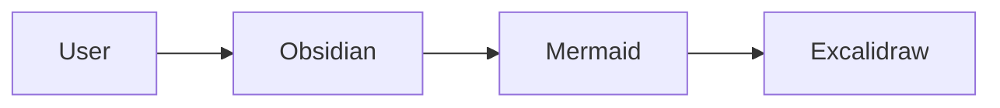
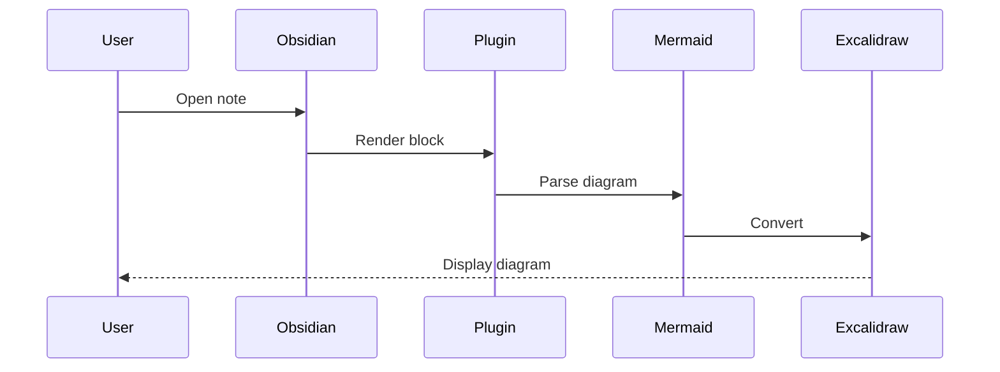
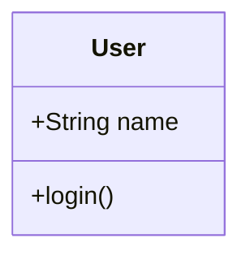
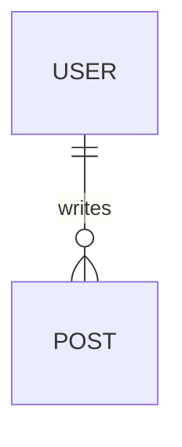
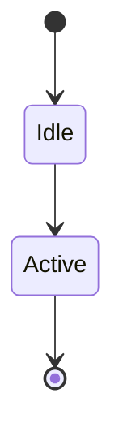
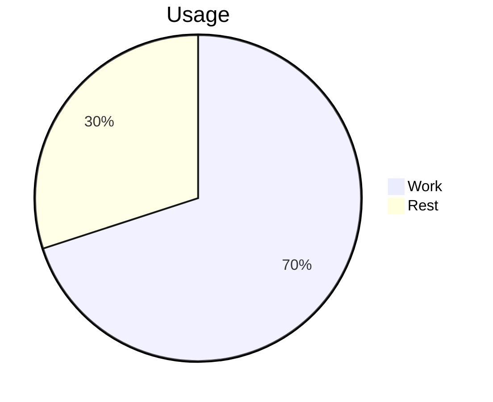

# Mermaid Excalidraw Renderer

Obsidianの `mermaid-excalidraw` コードブロックをExcalidrawの手書き風の図として表示するCommunity Pluginです。他のExcalidrawプラグインには依存しません。標準の `mermaid` ブロックはそのまま利用できます。

## Installation

開発にはNode.js 22.13以上の22系、または24以上とnpmが必要です。`.nvmrc` は22系を指定しています。

```sh
npm install
npm run build
```

生成される `dist/mermaid-excalidraw-renderer/` フォルダーをVaultの `.obsidian/plugins/` にコピーしてください。次の3ファイルがあれば動作します。

```text
.obsidian/plugins/mermaid-excalidraw-renderer/
├── main.js
├── manifest.json
└── styles.css
```

Obsidianの「設定 → コミュニティプラグイン」でMermaid Excalidraw Rendererを有効にします。現在は手動導入版で、Community Plugin一覧への登録はまだ行っていません。

最低Obsidianバージョンは1.5.0です。使用するコードブロックprocessor、`MarkdownRenderChild`、設定保存、workspaceの `css-change` は公開APIです。**MVPはデスクトップ専用**です。大きなCanvas・同梱フォントのメモリ使用量とモバイルWebViewの挙動を未検証のため、`isDesktopOnly: true` としています。

## Usage

ノートに `mermaid-excalidraw` コードブロックを記述してReading Viewで開きます。

````markdown

````

表示はExcalidrawの公開 `viewModeEnabled` と `zenModeEnabled` を使っています。編集・保存・画像挿入・AI機能は無効で、パン・ズームは使用できます。空のMainMenuを渡して既定の編集メニューを置き換えます。Excalidraw自身のメニューボタンなど、公開APIで除去できない枠は残ります。図内のリンクは開きません。

ObsidianのLight/Dark変更に追従します。ウィンドウのサイズ変更に合わせてbounding boxから高さを計算し、全体が見える倍率に調整します。デフォルトでは240–600pxで、最大高さを200pxに設定した場合は200pxになります。

設定画面では次の項目を変更できます。開いている図にも反映し、`loadData()` / `saveData()` で永続化します。

| 設定 | デフォルト | 範囲 |
| --- | ---: | ---: |
| Font size | 20px | 12–48px |
| Maximum diagram height | 600px | 200–1200px |

構文エラーはノート内に `Mermaid diagram could not be rendered.` と詳細を表示します。エラー文字列はReactのテキストとして表示し、HTMLとして挿入しません。

## Example

### Sequence Diagram

````markdown

````

### Class / ER / State

````markdown





````

### SVG fallback

Gantt・Pie・Timelineなど、上流がネイティブ変換しないタイプはSVG画像としてExcalidraw上に表示されます。その場合はMermaidの見た目が残ります。diagram typeはプラグインで制限せず、`files` を `addFiles()` に渡して上流のフォールバックを維持します。

````markdown

````

## Architecture

```text
Markdown code block
  → registerMarkdownCodeBlockProcessor("mermaid-excalidraw")
  → MarkdownRenderChild + createRoot()
  → conversion queue + parseMermaidToExcalidraw()
  → ExcalidrawElementSkeleton[] (+ files)
  → convertToExcalidrawElements()
  → API.updateScene() + API.addFiles()
  → bounding box / API.refresh() / API.scrollToContent()
  → <Excalidraw viewModeEnabled zenModeEnabled />
```

| ファイル | 責務 |
| --- | --- |
| `src/main.ts` | Obsidianの登録、テーマイベント、設定保存 |
| `src/renderer/MermaidExcalidrawRenderer.ts` | コードブロックとrender childの管理 |
| `src/renderer/ExcalidrawRenderChild.ts` | React Root、変換キャンセル、unmount |
| `src/renderer/conversion.ts` | 上流変換の呼び出し、順序制御、エラー処理 |
| `src/renderer/ExcalidrawView.tsx` | 公開React/APIでの閲覧表示、サイズ追従 |
| `src/renderer/layout.ts` | 高さ計算とテーマ判定 |
| `src/settings/` | 設定検証と設定タブ |
| `scripts/build-assets.mjs` | CSSのscope化とフォントのdata URL化 |

ノートの切り替えではObsidianがrender childをunloadし、必ず `root.unmount()` を実行します。プラグイン無効化でも残るchildをすべてunloadします。進行中の変換は中断できない上流処理の完了を待ち、キャンセル済みの結果を破棄します。待機中の変換は開始しません。ResizeObserverとanimation frameはcleanupします。テーマ変更のグローバルイベントはプラグイン単位で1つです。

## Dependencies and upstream compatibility

主要パッケージは `@excalidraw/excalidraw 0.18.1`、`@excalidraw/mermaid-to-excalidraw 2.2.2`、React / react-dom 18.3.1、Mermaid 11.17.2です。esbuildでCommonJSの `main.js` を生成します。Obsidianはhostが提供します。

**互換性上の制約:** 上流にはFlowchart・Sequence・Class・ER・Stateのネイティブ変換実装があります。11.12.1との組み合わせでは5種類とも手書き風に変換できることを実測しましたが、同バージョンにはHTML/CSS injection等の既知のadvisoryがあります。安全性を優先して11.17.2を採用しています。この構成ではClass・ER・StateのDOM構造/識別子が上流converterと合わず、確認用サンプルはSVG画像にフォールバックします。3種類も表示できますが、手書き風へのネイティブ変換は未達です。ER等では上流がフォールバック理由をconsoleに記録します。独自のSVG parserや依存ライブラリのprivate APIへのパッチは追加していません。今後、上流側が新しいMermaidの識別子に対応したら、依存更新と描画テストの再実行で改善できます。

インストール済み型に従い、0.18.1では `excalidrawAPI` コールバックを使用します。上流Playgroundの新しい `onInitialize` などはこの公開バージョンにはありません。上流を調査したファイルは `README.md`、`src/index.ts`、`src/parseMermaid.ts`、`src/graphToExcalidraw.ts`、`src/interfaces.ts`、`playground/ExcalidrawWrapper.tsx` です。

- [mermaid-to-excalidraw repository](https://github.com/excalidraw/mermaid-to-excalidraw)
- [Excalidraw public API](https://docs.excalidraw.com/docs/@excalidraw/excalidraw/api/props/)
- [Obsidian sample plugin](https://github.com/obsidianmd/obsidian-sample-plugin)

フォントをdata URLとして同梱するため、通常の描画にCDN接続は不要です。CSSセレクター・アニメーション名はプラグイン用scopeに変換します。上流フォント・バンドルしたJavaScriptのライセンスは `main.js` 内のコメントと、配布成果物の `THIRD_PARTY_NOTICES.txt` に収録します。

## Security and limits

Mermaidの公開設定 `securityLevel: "strict"` を使用し、`secure` で入力内のinit/frontmatterからsecurityLevel・サイズ制限などが上書きされないようにします。公開ラッパーの型は設定の一部のみを公開していますが、インストール済みソースが設定オブジェクトをMermaidへ渡すことを確認し、構造的型付けで追加設定を渡します。`any` やprivate APIへの依存はありません。

入力は50,000文字・500 edgeに制限します。変換ライブラリ内部では一時SVGを生成しますが、プラグイン自身でSVG/ASTを解析したり、Mermaid parserを実装したりしません。上流のSVGは上流のstrict設定でサニタイズされます。

図の変換精度・SVG fallbackのテーマ/文字サイズ・巨大図のレイアウトは上流仕様に依存します。同梱するフォントと全diagram rendererにより、配布バンドルは比較的大きくなります。MVPではキャッシュ・遅延mount・SVG/PNG/.excalidrawのエクスポートは実装していません。

## Development and verification

```sh
npm run dev          # TypeScript / CSSの変更をwatch
npm run typecheck
npm run lint
npm run test         # 設定・高さ・テーマ・変換ラッパーのunit test
npm run build
npm run test:browser # Chromeで実際の配布main.jsを検証
npm run test:vault   # 手動確認用のtest-vault/を生成
```

ブラウザーテストはObsidianのhost APIだけをmockし、配布用の実際の `main.js` とMermaid・React・Excalidrawを使用します。Flowchart・Sequenceのネイティブ変換、Class・ER・State・Gantt・Pie・TimelineのSVG fallback、構文エラー、20個同時描画、IDの重複、テーマ変更、設定変更、狭い画面、非同期処理中のunload、プラグイン無効化を検証します。上流のフォールバック診断だけを許容し、その他のconsole error・warning・未処理例外は失敗として扱います。描画例を `test-results/diagrams-light.png` / `diagrams-dark.png` に保存します。

ローカルはGoogle Chromeを使用します。Chromiumだけを使用する場合は次のように実行してください。

```sh
npx playwright install chromium
PLAYWRIGHT_CHANNEL=chromium npm run test:browser
```

`npm run test:vault` の後、Obsidianで `test-vault/` をVaultとして開き、`Diagrams`、`Multiple diagrams`、`Empty note` を切り替えてReading Viewを確認してください。このフォルダーはGitの対象外です。最小対応バージョンやモバイルについては別途実機確認が必要です。

CIはNode.js 22でinstall・lint・unit test・build・Chromiumの描画テストを実行し、3ファイルの配布フォルダーと検証結果をartifactとして保存します。

2026-10-07のローカル検証では、install・build・typecheck・lint、15件のunit test、4件のブラウザーテストが成功しました。ブラウザーテストはproductionとdevelopmentのReactで実行し、20図でReact warningが出ないことを確認しました。macOS / Obsidian 1.13.7でもプラグインのロード、設定画面、Reading ViewのFlowchart・Sequence・SVG fallback・inline error、ノート切り替えを確認しています。ランタイム依存の `npm audit --omit=dev` は0件でした。
