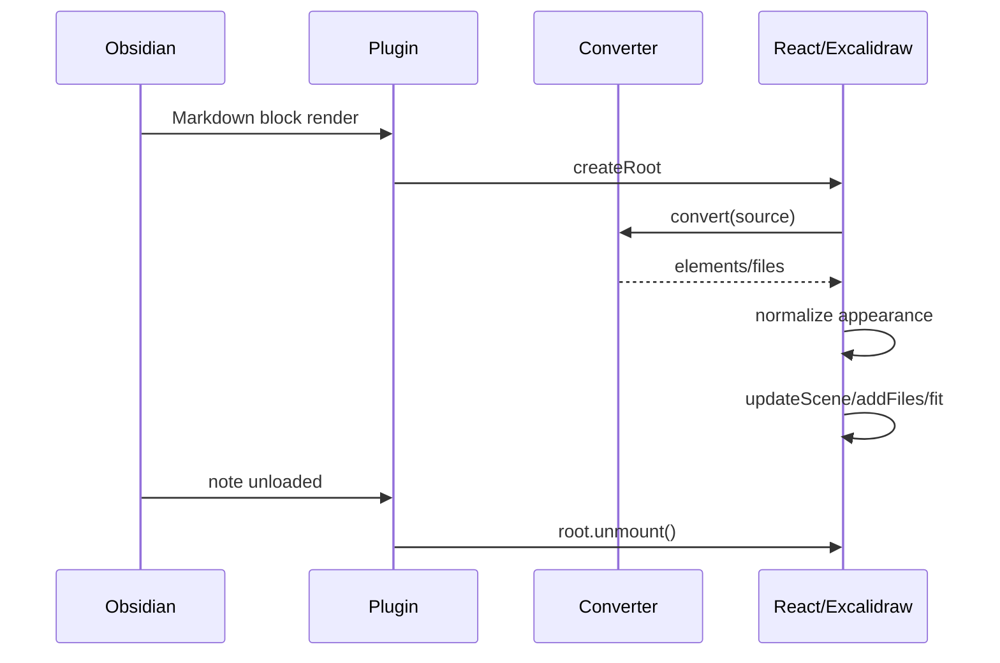
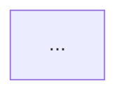

# Mermaid Excalidraw Renderer アーキテクチャ設計書

最終更新: 2026-10-07

## 1. 設計方針

本Pluginは「変換」と「表示」を分離する。

```text
Obsidian Integration
        ↓
Mermaid Conversion
        ↓
Appearance Normalization
        ↓
Excalidraw Rendering
```

## 2. Layer

### A. Obsidian Integration Layer

責務:
- Plugin lifecycle
- Markdown processor
- Settings
- `MarkdownRenderChild`

### B. Conversion Layer

責務:
- Mermaid source を upstream converter へ渡す
- conversion error を application error へ変換

非責務:
- Mermaid syntax解析
- layout計算

### C. Appearance Layer

責務:
- roughness
- foreground color
- backgroundとのコントラスト

非責務:
- diagram topology の変更

### D. Rendering Layer

責務:
- React mount
- Excalidraw instance
- files追加
- fit to content
- cleanup

## 3. Mermaid source を source of truth にする

保存されるのは Mermaid text。

Excalidraw element は表示時に毎回導出可能な派生データとして扱う。

このため MVP では Excalidraw element を Vault に永続化しない。

## 4. State

Global state を最小化する。

Plugin global:
- settings

Diagram local:
- source
- render status
- error
- Excalidraw API ref
- generated elements/files

## 5. Lifecycle



## 6. Failure isolation

1つのdiagramの失敗で他diagramを巻き込まない。

- diagram単位で try/catch
- global throw を避ける
- UI上に error boundary 相当の表示

## 7. 拡張ポイント

将来的な拡張を想定する。

- Theme mode: follow / light / dark
- 標準 `mermaid` 上書きモード
- SVG / PNG export
- `.excalidraw.md` 変換
- click-to-edit
- per-block options

## 8. Per-block option 将来案

例:

````markdown

````

ただしMVPでは実装しない。Settingsを優先する。

