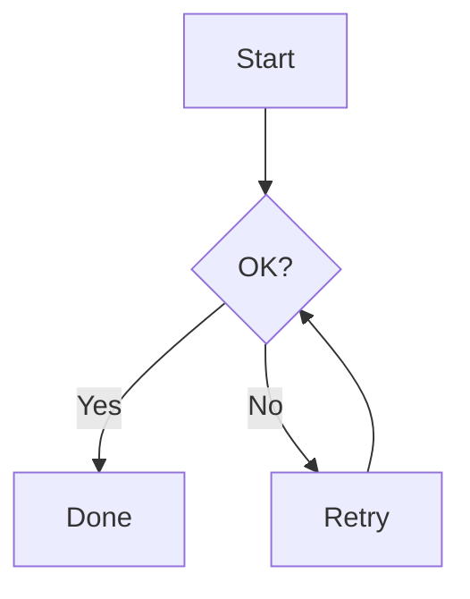
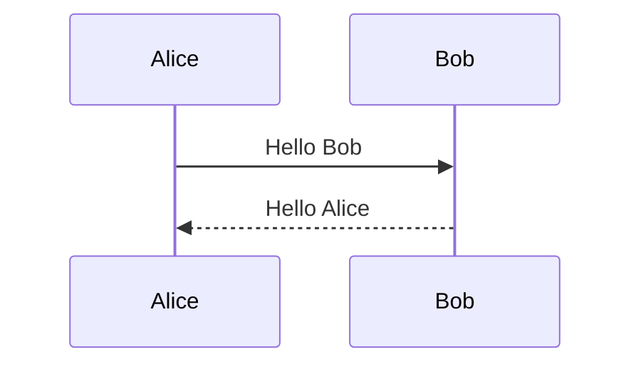
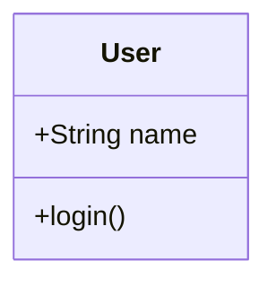
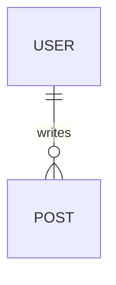

# Mermaid Excalidraw Renderer テスト計画書

最終更新: 2026-10-07

## 1. 目的

変換・表示・テーマ・設定・cleanup の主要リスクを検証する。

## 2. Unit Test

### Settings validation

- fontSize 下限/上限
- roughness が 0/1/2 のみ
- canvasHeight clamp
- canvasPadding clamp

### Theme resolution

- light → foreground black
- dark → foreground white
- CSS variable 取得成功
- CSS variable 不在時 fallback

### Appearance normalization

- supported elementへroughness反映
- text color反映
- line / arrow stroke反映
- unknown elementを壊さない

### Geometry

- canvas height calculation
- clamp
- padding

### Error mapping

- converter error → user-facing error
- unknown error → generic error

## 3. Integration Test

可能であれば jsdom / Vitest で次を検証。

- Markdown renderer wrapper生成
- React mount/unmount
- disposed後にstate updateしない

Excalidraw自体の完全描画はupstream責務なので、過度にmockしない。

## 4. Manual Test Matrix

| Case | Light | Dark | Expected |
|---|---|---|---|
| Flowchart | ✓ | ✓ | 全体表示、文字可読 |
| Sequence | ✓ | ✓ | lifeline/label可読 |
| Class | ✓ | ✓ | class text可読 |
| ER | ✓ | ✓ | relation可読 |
| State | ✓ | ✓ | transition可読 |
| Invalid Mermaid | ✓ | ✓ | inline error |
| 10 diagrams | ✓ | ✓ | crashなし |
| Roughness 0 | ✓ | ✓ | clean |
| Roughness 1 | ✓ | ✓ | architect |
| Roughness 2 | ✓ | ✓ | artist |
| Height min/max | ✓ | ✓ | layout破綻なし |

## 5. Sample inputs

### Flowchart



### Sequence



### Class



### ER



### Invalid

```text
flowchart TD
A -->
```

## 6. Performance

同一ノートに 20 個程度のdiagramを置き確認。

観点:
- 初期表示時間
- theme切替
- note切替
- memory増加
- React warning

## 7. Regression

PRごとに最低限:

1. `npm run build`
2. typecheck
3. unit test
4. Flowchart手動確認
5. Dark/Light確認

Release前:
- 全diagram matrix
- 複数diagram
- invalid Mermaid
- settings migration


## 2026-10-08 公開判定補足

上記チェックマークはテスト対象の指定であり今回の実測結果ではない。今回の結果はroot RELEASE_READINESS.mdへ記録する。production CJS bundleと実依存を使用するbrowser suiteで8種類、theme、20図、cleanup、設定保存、untrusted errorを確認する。Class/ER/StateはSVG fallbackを期待する。release suiteはversion drift、v prefix、manifest不正を拒否する。native minimum/現行stable、clean install、settings reload、disable/re-enableは別途実機gate。
