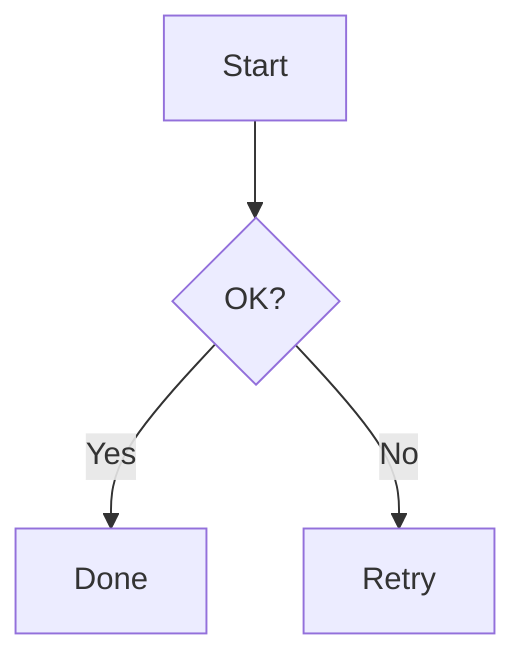

# Mermaid Excalidraw Renderer 基本仕様書

最終更新: 2026-10-07

## 1. 利用方法

### 入力

````markdown

````

### 出力

Reading View 上に Excalidraw 風 diagram を表示する。

## 2. 表示モード

MVP は閲覧主体。

- 編集ツールバーは可能な範囲で隠す
- pan / zoom は許容
- diagram 初期表示時に fit-to-content
- source の Mermaid を直接編集することで図を更新する

## 3. Settings

### Appearance

| 設定 | 型 | 既定値 | 範囲 |
|---|---|---:|---|
| Font size | number | 20 | 12〜48 |
| Roughness | enum | Architect(1) | 0 / 1 / 2 |
| Canvas height | number | 600px | 240〜1200 |
| Canvas padding | number | 32px | 16〜128 |
| Theme mode | enum | Follow Obsidian | 将来 Light / Dark追加可 |

### Roughness 表示名

- Clean: 0
- Architect: 1
- Artist: 2

## 4. テーマ仕様

### Light

- foreground: black
- background: Obsidian `--background-primary` を優先
- shape fill: transparent または背景近似色

### Dark

- foreground: white
- background: Obsidian `--background-primary` を優先
- shape fill: transparent または背景近似色

### 色正規化

Mermaid 由来の色より、可読性を優先して白黒へ寄せる。

SVG fallbackはupstreamの生成する構造・座標・フォントを保持し、文字・線・fillの色だけをDOMParserで正規化する。ホストDOMへ挿入しない。roughnessは画像の形状へ適用できない。カスタム背景ではLight/Darkの名前より実背景とのコントラストを優先する。

## 5. Canvas

基本 CSS:

```css
.mermaid-excalidraw-container {
  width: 100%;
  min-height: 240px;
  overflow: hidden;
}
```

実際の height は settings から設定する。

Canvas width は基本 `100%`。固定widthはMVPでは不要。

## 6. エラー表示

例:

```text
Mermaid diagram could not be rendered.
Parse error: ...
```

- エラー領域は `.mermaid-excalidraw-error`
- `textContent` で表示
- source をそのまま HTML として表示しない

## 7. Loading

非同期変換中は必要に応じて軽量な loading 表示を行ってよい。

例:

```text
Rendering diagram…
```

ただし短時間の場合にちらつくなら省略可能。

## 8. Theme変更

理想:
- Obsidian theme change を検知して表示中diagramも更新

MVP許容:
- ノート再レンダリング時に反映

## 9. CSS namespace

すべて `mermaid-excalidraw-` prefix を付ける。

例:
- `.mermaid-excalidraw-container`
- `.mermaid-excalidraw-error`
- `.mermaid-excalidraw-loading`


## 2026-10-08 公開仕様の確認

現在の依存構成ではFlowchart/Sequenceがnative変換、Class/ER/StateはSVG fallback。全対応diagramが手書きになるとは宣伝しない。テーマ変更と同一モード内のCSS変更は開いている図へ即時反映する。設定画面は単一セクションのため冗長なAppearance見出しを省略する。
