# Mermaid Excalidraw Renderer 技術仕様書

最終更新: 2026-10-07

## 1. 技術スタック

- TypeScript
- Obsidian Plugin API
- React
- `react-dom/client`
- `@excalidraw/excalidraw`
- `@excalidraw/mermaid-to-excalidraw`
- esbuild
- Vitest（unit test候補）

## 2. 変換フロー

```mermaid
flowchart LR
  A[Markdown code block] --> B[registerMarkdownCodeBlockProcessor]
  B --> C[Mermaid source]
  C --> D[parseMermaidToExcalidraw]
  D --> E[ExcalidrawElementSkeleton + files]
  E --> F[convertToExcalidrawElements + Appearance normalization]
  F --> G[Excalidraw scene update]
  G --> H[Excalidraw React component]
  H --> I[Reading View]
```



## 3. 推奨ディレクトリ

```text
src/
├── main.ts
├── renderer/
│   ├── MermaidExcalidrawRenderer.ts
│   ├── ExcalidrawRenderChild.ts
│   └── ExcalidrawView.tsx
├── appearance/
│   ├── applyAppearance.ts
│   └── resolveTheme.ts
├── settings/
│   ├── SettingsTab.ts
│   └── settings.ts
├── utils/
│   └── geometry.ts
└── types.ts
```

## 4. Plugin main

責務:

- settings load
- Markdown processor 登録
- settings tab 登録
- plugin unload

`main.ts` に変換ロジックやReact描画ロジックを書かない。

## 5. Mermaid converter

概念コード:

```ts
const result = await parseMermaidToExcalidraw(source, {
  themeVariables: {
    fontSize: `${settings.fontSize}px`,
  },
});
```

- 実際の install version の型を正とする
- diagram type を独自判定して制限しない

## 6. Excalidraw render

上流の Playground に合わせ、必要に応じて次の順で扱う。

1. skeleton → actual elements
2. `updateScene`
3. `addFiles`
4. `scrollToContent`

API 名や引数は installed version の型定義を優先する。

## 7. Appearance normalization

責務:

- foreground color
- shape fill
- roughness

イメージ:

```ts
type ResolvedAppearance = {
  foreground: string;
  background: string;
  roughness: 0 | 1 | 2;
};
```

Element type ごとに type guard / switch を利用する。

## 8. Theme resolution

候補:

- `document.body` / Obsidian が付与する theme class
- `getComputedStyle(document.body)`
- `--background-primary`
- `--text-normal`

優先順位:

1. Obsidian CSS variable
2. Light/Dark判定
3. fallback色

## 9. React lifecycle

`MarkdownRenderChild` を継承したクラスに React Root を保持する。

```ts
class ExcalidrawRenderChild extends MarkdownRenderChild {
  constructor(containerEl: HTMLElement, private root: Root) {
    super(containerEl);
  }

  onunload() {
    this.root.unmount();
  }
}
```

実際の実装では二重unmountを防ぐ。

## 10. Async cancel

Mermaid変換中にノート切替が発生する可能性がある。

推奨:

```ts
let disposed = false;

// async
if (disposed) return;

// onunload
disposed = true;
```

または component state + cleanup を用いる。

## 11. Settings 型

```ts
interface MermaidExcalidrawSettings {
  fontSize: number;
  roughness: 0 | 1 | 2;
  canvasHeight: number;
  canvasPadding: number;
  themeMode: "follow-obsidian";
}
```

## 12. Build artifact

Community Plugin 配布物:

```text
main.js
manifest.json
styles.css
```

## 13. 禁止事項

- Mermaid parser の自作
- SVG DOM の独自解析による変換再実装
- `any` での強制上書き
- Excalidraw private API依存
- renderer 内の巨大な責務集中


## 2026-10-08 実装整合

実装順はparseMermaidToExcalidraw → convertToExcalidrawElements → appearance/SVG配色正規化 → updateScene/addFiles → refresh/scrollToContent。現行モジュールはREADMEおよびsrc/を参照。依存はExcalidraw 0.18.1、converter 2.2.2、Mermaid 11.17.2、React/react-dom 18.3.1。Class/ER/Stateのfallbackは既知の互換性制約。minimumは1.13.7、desktop onlyを維持。配布物の追加ライセンス/検証ファイルはリリース運用手順に従う。
